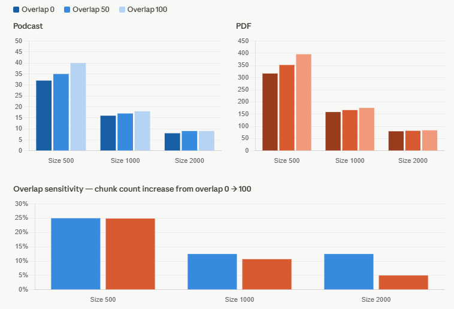

### Analysis questions:

* Does fixed-size chunking break sentences in the middle?
Yes, it does break the sentences, even words.
* How does it handle paragraph boundaries?
Does not seem to have paragraph boundaries. Paragraphs are treated as characters.
* Which content type handles fixed-size chunking better?
It seems to work better for the pdf. Pdf is structured, shows lower overlapping for 2000 size. 

Visual Comparison:

Few takeaways:
* Chunk size has by far the largest effect (Halving the chunk size roughly doubles the number of chunks in both sources)
* Overlap sensitivity shrinks as chunks get larger. 
* The PDF is far less sensitive to overlap at large chunk sizes than the podcast.

**Recommendation**: for a podcast, size 1000 with overlap 50–100 is a reasonable sweet spot — one gets meaningful context preservation without an explosion in chunk count. For the PDF, size 500 with overlap 50 gives fine-grained retrieval while keeping the chunk count manageable.

Available chunk sets:
podcast_size_500_overlap_0: 32 chunks
podcast_size_500_overlap_50: 35 chunks
podcast_size_500_overlap_100: 40 chunks
podcast_size_1000_overlap_0: 16 chunks
podcast_size_1000_overlap_50: 17 chunks
podcast_size_1000_overlap_100: 18 chunks
podcast_size_2000_overlap_0: 8 chunks
podcast_size_2000_overlap_50: 9 chunks
podcast_size_2000_overlap_100: 9 chunks
pdf_size_500_overlap_0: 317 chunks
pdf_size_500_overlap_50: 352 chunks
pdf_size_500_overlap_100: 396 chunks
pdf_size_1000_overlap_0: 159 chunks
pdf_size_1000_overlap_50: 167 chunks
pdf_size_1000_overlap_100: 176 chunks
pdf_size_2000_overlap_0: 80 chunks
pdf_size_2000_overlap_50: 82 chunks
pdf_size_2000_overlap_100: 84 chunks

Example podcast chunk:
[Part 1]
So, imagine for a second you're driving across a, I don't know, a massive suspension bridge. Okay. You don't pull over halfway across, get out, and demand to see the blueprints, right? You don't interview the welding crew. No, you just trust it. You just drive. You trust the bridge. You trust the engineering standards, the inspections, the laws that say this thing won't fail. Right. It's trust in the infrastructure. It's invisible, but it's there. Exactly. But now, let's switch gears. T

Example PDF chunk:
[Page 1]
INDEPENDENT  
HIGH-LEVEL EXPERT GROUP ON  
ARTIFICIAL INTELLIGENCE  
SET UP BY THE EUROPEAN COMMISSION  
 
 
 
 
 
 
ETHICS GUIDELINES  
FOR TRUSTWORTHY AI

[Page 2]
ETHICS GUIDELINES  FOR  TRUSTWORTHY  AI 
 
High -Level Expert Group on Artificial Intelligence  
 
 
 
 
This document was written by the High -Level Expert Group on AI (AI HLEG) . The members of the AI HLEG 
named in this document support the overall framework for Trustworthy  AI put forward in these Guidelines, 
a
