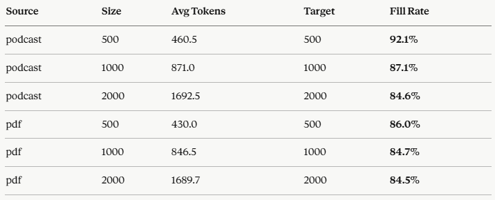

#Results analysis:

* **Conclusion:** For podcast, token chunking seems to be a better production choice compared to recursive character chunking. Is better on efficiency (i.e. 8 podcast chunks which means fewer embeddings, no loss of information as each token chunk is almost full) and predictability (token chunks have an 85-92% fill rate with near zero variances across chunks)

=> In short: token chunking gives you tighter control, lower cost, and better alignment with how the model will consume the chunks, without meaningful loss in boundary quality.

* **Fill rate drops as chunk size grows — for both documents.** For the podcast, 92% at 500 down to 85% at 2000.The larger the window, the harder it is to find a clean boundary close to the limit. This is a universal property of any boundary-respecting splitter, regardless of content.
* **PDF fills less efficiently than podcast at small sizes**, but they converge at large sizes. At size 500, the PDF's page breaks and sparse header regions force the splitter to stop early much more often. But by size 2000, both settle around 84–85%, meaning the large window simply absorbs those structural gaps and the bottleneck becomes the same for both — finding any good boundary near a 2000-token limit.

Token accuracy check — podcast | size 500 | first 3 chunks:
------------------------------------------------------------
  Chunk 1:  498 tokens |  2237 chars | ratio 4.49 chars/token
  Preview: [Part 1]
So, imagine for a second you're driving across a, I don't know, a massive suspension bridge. Okay. You don't pu...

  Chunk 2:  500 tokens |  2297 chars | ratio 4.59 chars/token
  Preview: , Python code. You've got three pillars, four principles, and seven concrete requirements to get through. And a checklis...

  Chunk 3:  497 tokens |  2457 chars | ratio 4.94 chars/token
  Preview: the experts derive four ethical principles from those rights. These are the non-negotiables. Okay, let's run through th...

Token accuracy check — pdf | size 500 | first 3 chunks:
------------------------------------------------------------
  Chunk 1:  419 tokens |  1840 chars | ratio 4.39 chars/token
  Preview: [Page 1]
INDEPENDENT  
HIGH-LEVEL EXPERT GROUP ON  
ARTIFICIAL INTELLIGENCE  
SET UP BY THE EUROPEAN COMMISSION...

  Chunk 2:  412 tokens |  1641 chars | ratio 3.98 chars/token
  Preview: any person acting on behalf of the Commission is responsible for the use which 
might be made of the following informat...

  Chunk 3:  465 tokens |  2131 chars | ratio 4.58 chars/token
  Preview: CLUSION  35 
GLOSSARY  36

[Page 4]
2 
 EXECUTIVE  SUMMARY  
The aim of the Guideline s is to promot e Trustworthy  AI....

Available token chunk sets:
  podcast_tokens_500: 8 chunks  (first chunk: 498 tokens)
  podcast_tokens_1000: 4 chunks  (first chunk: 998 tokens)
  podcast_tokens_2000: 2 chunks  (first chunk: 1995 tokens)
  pdf_tokens_500: 85 chunks  (first chunk: 419 tokens)
  pdf_tokens_1000: 41 chunks  (first chunk: 832 tokens)
  pdf_tokens_2000: 20 chunks  (first chunk: 1709 tokens)
